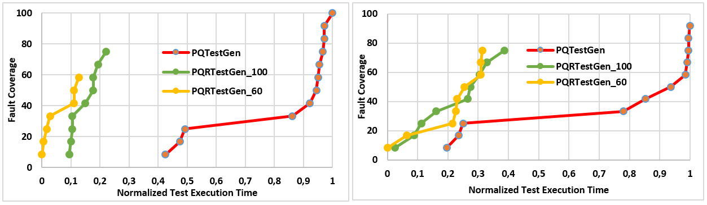
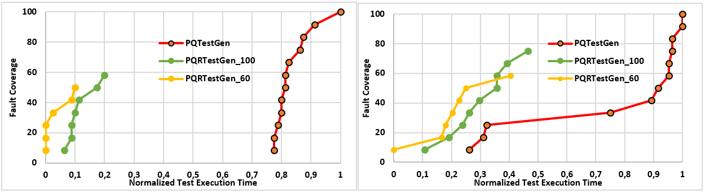

# Model-based Ideal Testing of GUI Programs

This web page provides an MBIT framework with tool supports for graphical user interface (GUI) testing of a software to reproduce the current methodology. The framework combines the holistic and mutation testing to achieve ideal testing. See Fig. 1 for general flow of MBIT for GUI programs. The MBIT comprises test preparation and testing steps for which details are given below.

<figure>

<figcaption>Fig.1 - The General Flow.</figcaption>

</figure>

[1.Test preparation](#1)

*   [1.1.Model construction(Manual)](#1.1)
*   [1.2.Mutant Generation(Manual)](#1.2)
*   [1.3.Model Conversion(Automatic)](#1.3)
*   [1.4.Test Generation(Automatic)](#1.4)

[2.Testing](#2)

*   [2.1.Test execution(Automatic)](#2.1)
*   [2.2.Test selection(Automatic)](#2.2)

The rough details including tool supports will be explained as follows considering given steps.

## 1.Test preparation

It is the first step of the framework, which starts with construction of the model from GUI under test (GUT). The GUI under test is modeled by means of a finite state machine(FSM) manually using JFLAP or PQ-Analysis tool. The model constructed is called original or fault-free FSM. Then, the mutants are generated from the original FSM by utilizing mutation operators that are specific to the FSM. Then, the models including mutants are converted to the regular expressions(REs) using JFLAP tool or PQ-Analysis tool. At the final step of the test preparation, the test sequences are generated from the corresponding RE models automatically using PQ-TestGen and PQ-RanTest tools.

**1.1** Model construction step requires expertise of the designer or tester who knows basics of the GUT. However, it can be directly constructed from the given specification of the GUT without expertise and extensive human effort. In proposed framework, it is constructed from the GUT manually with knowledge of tester about the system. The JFLAP tool is preferred due to its easy to use interface. The FSM model is drawn using the interface of the JFLAP tool. Note that this step can be carried by using PQ-Analysis tool but there isn't any direct interface exist to draw the FSM model. Therefore, the choice of PQ-Analysis tool requires a basic knowledge of the tool.

#### Tool Support:

We use JFLAP for modeling GUI under test.

*   [1]JFLAP, available at [http://www.jflap.org/](http://www.jflap.org/)
*   [2]PQ-Analysis, avaliable at [http://download.ivknet.de/](http://download.ivknet.de/)

#### Case Studies (CSs):

*   Special Module

Please download JFLAP file of Special Module given below. Then, open this file with JFLAP program given at the tool support.See Figure 2 for the FSM model of Special Module.

*   CS 1: ISELTA [http://iselta.ivknet.de/](http://iselta.ivknet.de/) "Special" Module
 

<figure>

<figcaption>Fig.2 - The FSM Model of Special Module</figcaption>

</figure>

*   Additional Module

Please download JFLAP file of Additional Module given below.Then, open this file with JFLAP program given at the tool support.See Figure 3 for the FSM model of Additional Module.

*   CS 2: ISELTA [http://iselta.ivknet.de/](http://iselta.ivknet.de/) "Additional" Module
 

<figure>

<figcaption>Fig.3 - The FSM Model of Additional Module</figcaption>

</figure>

**1.2** Mutant generation step is carried manually by means of the JFLAP tool. It requires utilization of the mutation operators that are a delete, insert, or replace of a state or transition of the FSM. Note that the selection and application of proper mutation operator, or combination of them, is based on the internal behavior of the system. Because we only focus on semantic fault that has a mean and changes specific behavior of the system. The selected behavior for the mutation is needed to be realized at code level. Therefore, the rest of the faults are neglected from the proposed framework.

#### Tool Support:

*   [1]JFLAP, available at [http://www.jflap.org/](http://www.jflap.org/)
*   [2]PQ-Analysis, avaliable at [http://download.ivknet.de/](http://download.ivknet.de/)

#### Case Studies (CSs):

*   Special Module

Please download JFLAP file for mutant versions of Special Module given below. Then, open this file with JFLAP program given at the tool support.See Figure 4 for the FSM model for mutant 1 of Special Module.

 

<figure>

<figcaption>Fig.4 - The FSM Model for mutant 1 of Special Module</figcaption>

</figure>

You may use other mutant versions of Special Module given below.

  

*   Additional Module

Please download JFLAP file for mutant versions of Special Module given below. Then, open this file with JFLAP program given at the tool support.See Figure 5 for the FSM model for mutant 1 of Additional Module.

 

<figure>

<figcaption>Fig.5 - The FSM Model for mutant 1 of Additional Module</figcaption>

</figure>

You may use other mutant versions of Special Module given below.

  

**1.3** Model conversion step is carried out manually using JFLAP tool for original and each mutant models. This step can be also done using PQ-Analysis tool, which results in longer RE models due usage of different conversion algorithm than JFLAP tool.

#### Tool Support:

*   [1]JFLAP, available at [http://www.jflap.org/](http://www.jflap.org/)
*   [2]PQ-Analysis, avaliable at [http://download.ivknet.de/](http://download.ivknet.de/)

#### Case Studies (CSs):

*   Special Module

You may convert given FSM model of Special Module or use already converted RE model given below.

 

*   Additional Module

You may convert given FSM model of Additional Module or use already converted RE model given below.

 

**1.4** Test generation step is done using PQ-TestGen and PQ-RanTest tool which takes inputs from the PQ-Analysis results. Note than there is preliminary step between model conversion and test generation called analysis step that results in context table, which represents the RE after analysis. The resulted tables are used in test generation algorithms.

#### Tool Support:

*   [1]PQ-Analysis, avaliable at [http://download.ivknet.de/](http://download.ivknet.de/)
*   [2]PQ-TestGen, download link for jar file
[Link](TestGen_v3.jar)

*   [3]PQ-RanTest, download link for jar file
[Link](TestGen_v3.jar)

#### Case Studies (CSs):

*   Special Module

You may convert given RE model to obtain PQ files using PQ-Analysis tool for Special Module or use already obtained PQ file given below for fault-free model and mutant models. Then you can generate test suites from the corresponding PQ files using PQ-TestGen tool given at the tool support. You can also use PQ-RanTest tool for test generation.

    

*   Special Module Test Suites    *   Additional Module

You may convert given RE model to obtain PQ files using PQ-Analysis tool for Additional Module or use already obtained PQ file given below for fault-free model and mutant models. Then you can generate test suites from the corresponding PQ files using PQ-TestGen tool given at the tool support. You can also use PQ-RanTest tool for test generation.

    

*   Additional Module Test Suites    

## 2.Testing

In testing step, the test sequences generated from original and mutant models are automatically executed on original and mutant GUT, which are depending on the positive and negative testing. In positive testing, the test sequences generated from original model are executed on mutant GUTs that are obtained from original GUT using mutation operators at code level. In negative testing, the test sequences generated from mutant models are executed on original GUT. These steps define test execution. In test selection, the failed test sequences from positive and negative testing for each execution are selected to achieve ideal test suite. To this end, the proposed framework satisfies requirements of the ideal testing in the scope of the model of GUT.

**2.1** Test execution step is performed by Selenium tool for which we write a generic test script in Java. The test script automatically reads the test sequences and execute them on the corresponding GUT.

#### Tool Support:

*   [1]Selenium, avaliable at [https://www.seleniumhq.org/](https://www.seleniumhq.org/)
*   [2]The generic test script, download link for Java file
[Link](ZeroOriginalFsmTests.java)

You can use Selenium test script given at the tool support to execute generated test suites on the Special and Additional Modules for test execution step.

**2.2** Test selection is also performed by means of Selenium tool in which the failed test sequences executed on corresponding GUT are selected and written to file that is called ideal test suite for each models.

#### Tool Support:

*   [1]Selenium, avaliable at [https://www.seleniumhq.org/](https://www.seleniumhq.org/)
*   [2]The generic test script, download link for Java file
[Link](ZeroOriginalFsmTests.java)

*   [3]The test selection script, download link for Java file
[Link](ZeroOriginalFsmTests.java)

You can use Selenium test script given at the tool support to select ideal test suites on the Special and Additional Modules for test selection step.

#### Results

Please see results for test execution for Special and Additional Module in Table 1-2 and Figure 6-7 respectively .

<figure>

<figcaption>Table.1 - Test results for Special Module</figcaption>

</figure>

<figure>

<figcaption>Table.2 - Test results for Additional Module</figcaption>

</figure>

<figure>

<figcaption>Fig.6 - Test results for Special Module</figcaption>

</figure>

<figure>

<figcaption>Fig.7 - Test results for Additional Module</figcaption>

</figure>

Note: Please do not hesitate to contact Onur Kilincceker (onurkilincceker@gmail.com) for any problems and comments.
